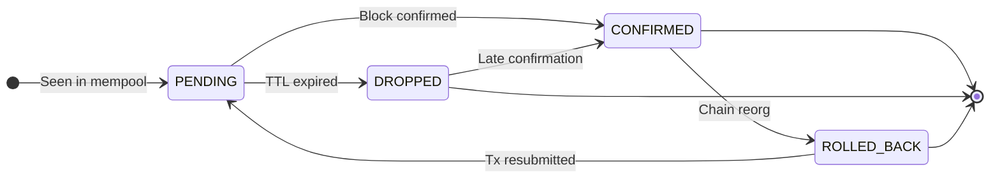

# System Architecture

## Overview

Single-process FastAPI application. On startup, it initialises two databases and launches background tasks under a supervisor loop. The HTTP/WebSocket server runs in the same event loop. A `/health` endpoint exposes `pipeline_state` (OK / DEGRADED / DOWN), `sync_lag_seconds`, `last_processed_slot`, and `last_ogmios_msg_at`.

## Data Flow

```text
Cardano Node (Preprod / Mainnet)
        |
        v
Ogmios v6  (ws://host:1337)
        |
        +--[ChainSync]-----------> ClickHouse  [Analytics Warehouse]  (transactions, inputs, outputs)
        |                          PostgreSQL  [Operational Database]  (tx_lifecycle → CONFIRMED, sync_checkpoint)
        |                          Filesystem  [Data Lake]             (confirmed/{network}/{date}/{shard}/{tx_hash}.json.gz)
        |                          WebSocket                           (TX_CONFIRMED broadcast)
        |
        +--[LocalTxMonitor]------> queryLedgerState/utxo               (resolve input addresses + amounts, via LocalStateQuery connection)
        |                          Filesystem  [Data Lake]             (mempool/{network}/{date}/{shard}/{tx_hash}.json.gz)
        |                          PostgreSQL  [Operational Database]  (tx_lifecycle → PENDING)
        |                          WebSocket                           (TX_PENDING broadcast)
        |
        +--[LocalStateQuery]-----> _pending_input_cache (in-memory)   (populated during mempool observation; consumed by ChainSync at confirmation time)

Rollback (rollBackward):
        +------------------------> PostgreSQL  [Operational Database]  (tx_lifecycle → ROLLED_BACK)
                                   WebSocket                           (TX_ROLLED_BACK broadcast)

Analysis Engine (background, interval-based):
        ClickHouse [Analytics Warehouse] (read unscored txs)
            --> enrich (resolve input addresses, collision data, cycle detection, sandwich patterns)
            --> score (9 attack-class scorers: gate/score pipeline per class)
            --> ClickHouse (write tx_class_scores: 9-element score vector per tx)
```

## Transaction Lifecycle



All state is stored in `tx_lifecycle` (PostgreSQL). Raw payloads are written asynchronously to the local filesystem Data Lake (`confirmed/` and `mempool/` prefixes, gzip JSON). `block_index` (0-based position within block) stored in ClickHouse `transactions` table for MEV analysis.

**ROLLED_BACK semantics:** Triggered when Ogmios sends `rollBackward` to a target point at slot S. Every transaction whose `confirmed_at` slot is strictly greater than S is marked ROLLED_BACK in a single `UPDATE`. A rolled-back transaction may re-appear in the mempool and be re-confirmed at a later block; if so the row returns to CONFIRMED and `rolled_back_at` is reset to NULL (`tx_lifecycle` keeps one canonical row per `tx_hash`).

**DROPPED semantics:** Ogmios `LocalTxMonitor` does not emit eviction notifications. The PENDING → DROPPED transition is assigned by a background cleanup sweep (runs with the analysis engine interval) when a PENDING transaction has been waiting longer than `LIFECYCLE_PENDING_TTL_SECONDS` (default: 7200 s / 2 h). DROPPED does not mean the transaction is invalid; it may have been resubmitted or confirmed on a branch not observed by this node.

## Storage

| Store | Role | Engine | Purpose |
|---|---|---|---|
| ClickHouse | **Analytics Warehouse** | MergeTree, daily partitions (`toYYYYMMDD`) | Structured blockchain facts: `transactions`, `transaction_inputs`, `transaction_outputs`, `address_transactions` (MV), `tx_class_scores` (9-class score vectors), `baselines` (per-script/per-policy/global percentile baselines). Append-only. `total_input_value` is `Nullable(UInt64)`; `NULL` means unresolved (tx confirmed without prior mempool observation); non-NULL for mempool-observed txs where inputs were resolved via `queryLedgerState/utxo`. |
| PostgreSQL | **Operational Database** | asyncpg connection pool | Mutable state: `tx_lifecycle`, `sync_checkpoint`, `entity_state`, `audit_logs`, `mempool_collisions` (front-running detection). Strong consistency; row-level UPDATE/DELETE. |
| Filesystem | **Data Lake** | Local FS → S3/MinIO (upgrade path) | Write-once gzip JSON blobs. `confirmed/{network}/{YYYYMMDD}/{shard}/{tx_hash}.json.gz` and `mempool/` prefix. Schema-on-read. Source of truth for raw Ogmios payloads; Analytics Warehouse is derived from this layer. |

## Resilience

- **Exponential backoff** on WebSocket disconnect (1 s base, 60 s max, +30% jitter)
- **Circuit breaker** per connection (chain and mempool isolated): CLOSED → OPEN after 5 failures → HALF_OPEN after 120 s cooldown. The query connection (LocalStateQuery) has no circuit breaker; failures reset the connection and return empty results, never blocking chain or mempool paths.
- **Keepalive**: ping every 30 s, pong timeout 90 s
- **Resume on restart**: last processed slot/block hash upserted to `sync_checkpoint` (PostgreSQL) after each block; used as `findIntersection` point on reconnect
- **Supervisor loop**: `chain_sync` and `mempool_monitor` tasks are wrapped in a supervisor that restarts them on unexpected exit (clean shutdown and `CancelledError` are not restarted)
- **Pipeline observability**: `pipeline_state` (OK / DEGRADED / DOWN), `sync_lag_slots`, `last_processed_slot`, `last_ogmios_msg_at` derived from circuit-breaker state and block recency; exposed at `GET /health`

## Security

- `TMS-API-Key` header on all API endpoints
- `API_KEYS` env var (comma-separated). Empty = open access (dev mode, logged as warning)
- Rate limiting: in-memory sliding window per API key (`RATE_LIMIT_REQUESTS` / `RATE_LIMIT_WINDOW_SECONDS`)
- CORS: open (`allow_origins=["*"]`), intended for reverse-proxy TLS termination in production

## Module Map

```text
backend/app/
├── main.py                  FastAPI app, lifespan, router registration
├── config.py                Pydantic Settings (reads .env)
├── auth.py                  TMS-API-Key dependency
├── rate_limit.py            Sliding-window rate limiter middleware
├── models/
│   └── transaction.py       NormalizedTransaction, TransactionInput/Output,
│                            lifecycle and analysis Pydantic models
├── ingestion/
│   ├── ogmios_client.py     Ogmios WS client: ChainSync + LocalTxMonitor + LocalStateQuery (UTxO input resolution)
│   ├── ogmios_parser.py     Ogmios v6 JSON → NormalizedTransaction
│   └── resilience.py        ExponentialBackoff, CircuitBreaker
├── db/
│   ├── clickhouse.py        Analytics Warehouse: schema, batch insert, analytical queries
│   ├── postgres.py          Operational Database: schema, tx_lifecycle CRUD, sync_checkpoint, entity_state
│   └── raw_store.py         Data Lake: async gzip writes, atomic rename, read-back
├── api/
│   ├── transactions.py      GET /api/transactions/*
│   ├── lifecycle.py         GET /api/lifecycle/*
│   ├── analysis.py          GET /api/analysis/*
│   └── entities.py          GET/PUT /api/entities/*
├── analysis/
│   ├── engine.py            Multi-class orchestrator (9 attack classes, enrichment, scoring)
│   ├── normalise.py         Percentile-based normalisation and baseline resolution
│   ├── baselines.py         Baseline computation and drift detection
│   ├── features.py          UTxO-level and tx-level feature extraction from raw Ogmios data
│   ├── graph.py             Transfer graph cycle detection (bounded BFS) for Circular scorer
│   ├── dex.py               Structural sandwich pattern detection
│   ├── external.py          Reference data (token registry, phishing feeds, protocol domains)
│   └── scorers/
│       ├── base.py          BaseScorer interface and ScorerResult dataclass
│       ├── token_dust.py    Class 1: Token Dust (value size spam)
│       ├── large_value.py   Class 2: Large Value (quantity magnitude bloat)
│       ├── large_datum.py   Class 3: Large Datum (oversized inline datum)
│       ├── multiple_sat.py  Class 4: Multiple Satisfaction (redeemer reuse)
│       ├── front_running.py Class 5: Front-Running (UTxO displacement)
│       ├── sandwich.py      Class 6: Sandwich Attack (DEX exploit)
│       ├── circular.py      Class 7: Circular Transfers (wash trading / layering)
│       ├── fake_token.py    Class 8: Fake Token Distribution (homoglyph impersonation)
│       └── phishing.py      Class 9: Phishing via Metadata (malicious URLs / social engineering)
├── tasks/
│   └── analysis.py          Background task: runs engine on interval
└── routers/
    ├── websocket.py         WS /ws: lifecycle event broadcast
    └── ui.py                GET /: operator dashboard (HTML)
```

## Deployment

See [C4-ARCHITECTURE.md](C4-ARCHITECTURE.md) for full C4 diagrams (context, container, component, deployment) and [TECHNOLOGY-DECISIONS.md](TECHNOLOGY-DECISIONS.md) for ADRs covering each technology choice.

Databases run in Docker Compose. App can run on host or as a Docker container (`docker-compose --profile app up -d`). TLS must be handled at the reverse-proxy layer (nginx, Caddy, etc.).

**Ogmios version pinning:** TMS targets **Ogmios v6.x** (JSON-RPC 2.0 interface) co-located with **cardano-node 8.x / 9.x**. The message shapes in `ogmios_parser.py` are tied to the v6 schema. When upgrading cardano-node, verify the matching Ogmios version and re-validate parser output before deploying. See ADR-004 in [TECHNOLOGY-DECISIONS.md](TECHNOLOGY-DECISIONS.md) for the upgrade checklist.
