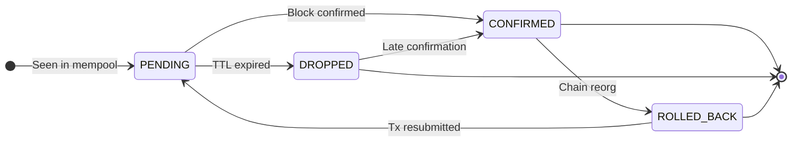

# System Architecture

## Overview

Single-process FastAPI application. On startup, it initialises two databases and launches background tasks under a supervisor loop. The HTTP/WebSocket server runs in the same event loop. A minimal unauthenticated `/health` returns `{"status":"healthy"}` for liveness probes; the authenticated `/health/detail` exposes `pipeline_state` (OK / DEGRADED / DOWN), `sync_lag_seconds`, `last_processed_slot`, and `last_ogmios_msg_at`.

An **optional** first-party clustering module (`services/clustering/`, the `clustering` Compose profile) runs as a sidecar and contributes a tenth, unsupervised attack class, `contract_anomaly`; the host merges its verdicts at read time. See [Clustering module](#clustering-module-contract_anomaly) below. Absent the profile, the system is exactly the nine-class detection engine described here.

## Data Flow

```text
Cardano Node (Preprod / Mainnet)
        |
        v
Ogmios v6  (ws://host:1337)
        |
        +--[ChainSync]-----------> ClickHouse  [Analytics Warehouse]  (transactions, inputs, outputs)
        |                          PostgreSQL  [Operational Database]  (tx_lifecycle → CONFIRMED, sync_checkpoint)
        |                          Filesystem  [Data Lake]             (confirmed/{network}/{date}/{shard}/{tx_hash}.json.gz)
        |                          WebSocket                           (TX_CONFIRMED broadcast)
        |
        +--[LocalTxMonitor]------> queryLedgerState/utxo               (resolve input addresses + amounts, via LocalStateQuery connection)
        |                          Filesystem  [Data Lake]             (mempool/{network}/{date}/{shard}/{tx_hash}.json.gz)
        |                          PostgreSQL  [Operational Database]  (tx_lifecycle → PENDING)
        |                          WebSocket                           (TX_PENDING broadcast)
        |
        +--[LocalStateQuery]-----> _pending_input_cache (in-memory)   (populated during mempool observation; consumed by ChainSync at confirmation time)

Rollback (rollBackward):
        +------------------------> PostgreSQL  [Operational Database]  (tx_lifecycle → ROLLED_BACK)
                                   WebSocket                           (TX_ROLLED_BACK broadcast)

Analysis Engine (background, interval-based):
        ClickHouse [Analytics Warehouse] (read unscored txs)
            --> enrich (resolve input addresses, collision data, cycle detection, sandwich patterns)
            --> score (9 attack-class scorers: gate/score pipeline per class)
            --> ClickHouse (write tx_class_scores: 9-element score vector per tx)
```

## Transaction Lifecycle



All state is stored in `tx_lifecycle` (PostgreSQL). Raw payloads are written asynchronously to the local filesystem Data Lake (`confirmed/` and `mempool/` prefixes, gzip JSON). `block_index` (0-based position within block) stored in ClickHouse `transactions` table for MEV analysis.

**ROLLED_BACK semantics:** Triggered when Ogmios sends `rollBackward` to a target point at slot S. Every transaction whose `confirmed_at` slot is strictly greater than S is marked ROLLED_BACK in a single `UPDATE`. A rolled-back transaction may re-appear in the mempool and be re-confirmed at a later block; if so the row returns to CONFIRMED and `rolled_back_at` is reset to NULL (`tx_lifecycle` keeps one canonical row per `tx_hash`).

**DROPPED semantics:** Ogmios `LocalTxMonitor` does not emit eviction notifications. The PENDING → DROPPED transition is assigned by a background cleanup sweep (runs with the analysis engine interval) when a PENDING transaction has been waiting longer than `LIFECYCLE_PENDING_TTL_SECONDS` (default: 7200 s / 2 h). DROPPED does not mean the transaction is invalid; it may have been resubmitted or confirmed on a branch not observed by this node.

## Storage

| Store | Role | Engine | Purpose |
|---|---|---|---|
| ClickHouse | **Analytics Warehouse** | MergeTree, daily partitions (`toYYYYMMDD`) | Structured blockchain facts: `transactions`, `transaction_inputs`, `transaction_outputs`, `address_transactions` (MV), `tx_class_scores` (9-class score vectors), `baselines` (per-script/per-policy/global percentile baselines). Append-only. `total_input_value` is `Nullable(UInt64)`; `NULL` means unresolved (tx confirmed without prior mempool observation); non-NULL for mempool-observed txs where inputs were resolved via `queryLedgerState/utxo`. |
| PostgreSQL | **Operational Database** | asyncpg connection pool | Mutable state: `tx_lifecycle`, `sync_checkpoint`, `entity_state`, `audit_logs`, `mempool_collisions` (front-running detection). Strong consistency; row-level UPDATE/DELETE. |
| Filesystem | **Data Lake** | Local FS → S3/MinIO (upgrade path) | Write-once gzip JSON blobs. `confirmed/{network}/{YYYYMMDD}/{shard}/{tx_hash}.json.gz` and `mempool/` prefix. Schema-on-read. Source of truth for raw Ogmios payloads; Analytics Warehouse is derived from this layer. |

## Resilience

- **Exponential backoff** on WebSocket disconnect (1 s base, 60 s max, +30% jitter)
- **Circuit breaker** per connection (chain and mempool isolated): CLOSED → OPEN after 5 failures → HALF_OPEN after 120 s cooldown. The query connection (LocalStateQuery) has no circuit breaker; failures reset the connection and return empty results, never blocking chain or mempool paths.
- **Keepalive**: ping every 30 s, pong timeout 90 s
- **Resume on restart**: last processed slot/block hash upserted to `sync_checkpoint` (PostgreSQL) after each block; used as `findIntersection` point on reconnect
- **Supervisor loop**: `chain_sync` and `mempool_monitor` tasks are wrapped in a supervisor that restarts them on unexpected exit (clean shutdown and `CancelledError` are not restarted)
- **Pipeline observability**: `pipeline_state` (OK / DEGRADED / DOWN), `sync_lag_slots`, `last_processed_slot`, `last_ogmios_msg_at` derived from circuit-breaker state and block recency; exposed at `GET /health/detail` (API-key authenticated)

## Security

The API supports two authentication paths, both implemented under `app/auth/`:

- **Programmatic: `X-API-Key` header** (`auth/api_key.py`, constant-time compare). `API_KEYS` env var (comma-separated). Empty = open access; startup aborts unless `TMS_ALLOW_DEV_MODE=1` is also set (prevents accidental unauthenticated production deploys).
- **Interactive: magic-link sessions** (`auth/tokens.py`, `auth/sessions.py`, `auth/email.py`). A user requests a login email (`POST /api/v1/auth/request-link`), the link mints a session cookie on verify, and `auth/deps.py` exposes `require_user` / `require_admin` dependencies. Accounts (`users` table) carry an `Admin` or `Reviewer` role; the first Admin is bootstrapped via `python -m app.cli create-admin`. Magic-link delivery goes through SMTP (`SMTP_*` settings; `mailpit` in the dev compose stack).
- Rate limiting: in-memory sliding window keyed per API key / IP (`RATE_LIMIT_REQUESTS` / `RATE_LIMIT_WINDOW_SECONDS`)
- Audit logging: privileged actions are written to the PostgreSQL `audit_logs` table (`app/audit.py`)
- CORS: configurable via `CORS_ALLOW_ORIGINS`, intended for reverse-proxy TLS termination in production

## Module Map

```text
backend/app/
├── main.py                  FastAPI app, lifespan, router registration
├── config.py                Pydantic Settings (reads .env): API, DB, auth, SMTP, rate-limit knobs
├── cli.py                   Admin CLI (`python -m app.cli create-admin ...`): first-user bootstrap
├── net.py                   Network/address helpers (CIP-19 prefixes, bech32)
├── audit.py                 Structured audit-log writer (PostgreSQL audit_logs)
├── rate_limit.py            Sliding-window rate limiter middleware
├── csrf.py                  CSRF double-submit middleware for cookie-authed mutating routes
├── leader.py                PostgreSQL advisory-lock leader guard (single ingestion/analysis instance, standby promotion)
├── logging_utils.py         Access-log redaction (strips magic-link tokens from uvicorn request lines)
├── auth/                    Authentication package
│   ├── api_key.py           X-API-Key dependency (constant-time compare)
│   ├── deps.py              require_user / require_admin session dependencies
│   ├── tokens.py            Magic-link token mint/verify
│   ├── sessions.py          Session-cookie issue/lookup/revoke
│   ├── email.py             SMTP magic-link delivery
│   ├── models.py            User / UserRole (Admin, Reviewer) Pydantic models
│   └── schema.py            PostgreSQL users / magic_link_tokens / user_sessions DDL
├── models/
│   ├── transaction.py       NormalizedTransaction, TransactionInput/Output, lifecycle + analysis models
│   └── archive.py           Archive (false-positive curation) models
├── ingestion/
│   ├── ogmios_client.py     Ogmios WS client: ChainSync + LocalStateQuery (UTxO input resolution)
│   ├── mempool_monitor.py   LocalTxMonitor mempool polling + collision capture
│   ├── input_enrichment.py  Resolves output references to input UTxO values
│   ├── ogmios_parser.py     Ogmios v6 JSON → NormalizedTransaction (v5/v6 value + TTL shapes)
│   └── resilience.py        ExponentialBackoff, CircuitBreaker
├── db/
│   ├── clickhouse.py        Analytics Warehouse: client/executor, batch insert, analytical queries
│   ├── clickhouse_schema.py ClickHouse DDL, migrations, retention
│   ├── clickhouse_scores.py tx_class_scores read/write (per-class score vectors)
│   ├── clustering_queries.py Read-only access to the clustering sidecar's contract_anomaly verdicts (cross-DB, best-effort)
│   ├── postgres.py          Operational Database: tx_lifecycle, sync_checkpoint, entity_state, audit, schema
│   ├── archive_queries.py   Archive list/count/export queries
│   └── raw_store.py         Data Lake: async gzip writes, atomic rename, read-back
├── api/
│   ├── _params.py           Shared query-parameter declarations (the optional ?network selector)
│   ├── transactions.py      GET /api/v1/transactions/*
│   ├── lifecycle.py         GET /api/v1/lifecycle/*
│   ├── analysis.py          GET /api/v1/analysis/* (merges the contract_anomaly verdict + reconciles stats/timeseries when the clustering module is enabled)
│   ├── contract_anomaly_read.py  Read-time projection of the sidecar's verdicts into results/stats/timeseries (no stored scores)
│   ├── clustering.py        /api/v1/clustering/* reverse-proxy to the optional clustering sidecar (session-authed, host-fixed)
│   ├── notifications_config.py   GET/PUT /api/v1/notifications/config (Admin; channels, trigger matrix, recipients)
│   ├── entities.py          GET/PUT /api/v1/entities/*
│   ├── archive.py           GET/POST/DELETE /api/v1/archive/* (false-positive curation)
│   ├── auth.py              POST/GET /api/v1/auth/* (magic-link login, session, /me)
│   └── users.py             GET/POST/DELETE /api/v1/users/* (Admin user management)
├── analysis/
│   ├── engine.py            Multi-class orchestrator (9 attack classes, enrichment, scoring)
│   ├── scorer_config.py     Validated loader for config/detection.yaml
│   ├── normalise.py         Percentile-based normalisation and baseline resolution
│   ├── contract_anomaly.py  Projects the clustering sidecar's verdict onto the host 0-100 score / RiskBand (the synthetic contract_anomaly class)
│   ├── baselines.py         Baseline computation and drift detection
│   ├── features.py          UTxO/tx feature extraction (incl. decode_hex_asset_name, extract_ttl, is_script_address)
│   ├── enrichment.py        Cross-tx enrichment (collisions, cycles, ref-tx fan-in)
│   ├── graph.py             Transfer graph cycle detection (bounded BFS) for Circular scorer
│   ├── dex.py               Structural sandwich pattern detection
│   ├── url_extraction.py    URL extraction + PSL/TLD validation across metadata/datum/asset-name carriers
│   ├── plutus_text.py       Plutus-Data tree walk, UTF-8 span extraction from inline datums
│   ├── external.py          Reference data (token registry, phishing feeds, protocol domains)
│   └── scorers/
│       ├── base.py          BaseScorer interface and ScorerResult dataclass
│       ├── token_dust.py    Class 1: Token Dust (value size spam)
│       ├── large_value.py   Class 2: Large Value (quantity magnitude bloat)
│       ├── large_datum.py   Class 3: Large Datum (oversized inline datum)
│       ├── multiple_sat.py  Class 4: Multiple Satisfaction (redeemer reuse)
│       ├── front_running.py Class 5: Front-Running (UTxO displacement)
│       ├── sandwich.py      Class 6: Sandwich Attack (DEX exploit)
│       ├── circular.py      Class 7: Circular Transfers (wash trading / layering)
│       ├── fake_token.py    Class 8: Fake Token Distribution (homoglyph impersonation)
│       └── phishing.py      Class 9: Phishing via Metadata (malicious URLs / social engineering)
├── notifications/           Alerting package: band/class-triggered alerts + periodic reports
│   ├── config.py            Loader + validator for the notification config document
│   ├── triggers.py          resolve_dispatch: which channels/recipients fire for one alert
│   ├── dispatcher.py        Isolated fan-out to channels (timeouts, bounded concurrency)
│   ├── payloads.py          ImmediateAlert / PeriodicReport payload models
│   ├── reports.py           Periodic-report assembly from windowed stats
│   ├── registry.py          Channel registry (the hot-swap point for new channels)
│   └── channels/            NotificationChannel implementations (email, webhook)
├── tasks/
│   ├── analysis.py          Background task: runs engine on interval
│   ├── housekeeping.py      Always-on maintenance loop (DROPPED sweep, retention + auth purges), independent of scoring
│   └── notifications.py     Periodic-report scheduler + clustering contract_anomaly poller
├── utils/
│   └── datetime_utils.py    Naive-UTC ClickHouse datetime helpers shared across the API layer
└── routers/
    ├── websocket.py         WS /ws: lifecycle event broadcast
    └── ui.py                GET /: operator dashboard (HTML)
```

## Clustering module (contract_anomaly)

A first-party, **optional** sidecar (`services/clustering/`, gated behind the `clustering` Compose profile) that complements the nine supervised scorers with unsupervised, per-contract profiling. It is the source of the synthetic tenth attack class, `contract_anomaly`.

- **What it does:** for each watched contract (address) it pulls that contract's transactions, extracts shape/graph features, runs DBSCAN clustering plus an IsolationForest + LOF anomaly ensemble, and resolves a per-tx verdict (`malicious` / `benign` / `anomaly` / `normal`, with human labels overriding).
- **Topology:** it shares the same ClickHouse server as the host but owns a separate database (`tms_clustering`). It **reads** chain facts from the host's Analytics Warehouse (`tms_analytics`, no chain data is duplicated) and **writes** its own state (`cluster_models`, `tx_classifications`, and the `tx_contract_anomaly` projection).
- **How the host consumes it (read-time overlay, recall-first):** the host derives every score at read time and never trusts a precomputed one. `db/clustering_queries.py` reads the raw verdicts from `tx_contract_anomaly`; `analysis/contract_anomaly.py` projects them onto the 0-100 host scale via `config/detection.yaml` (so a calibration change there applies to all historical rows with no backfill, and `benign` / `normal` verdicts suppress to 0 while only `malicious` / `anomaly` carry a score); `api/analysis.py` merges that into results additively (it can only ever **raise** a tx's score/band, never lower it), supports filtering the list by `attack_class=contract_anomaly`, and reconciles the list view, band-count KPIs, and the alert timeseries. The Validators / cluster-graph UI talks to the sidecar through the `api/clustering.py` reverse-proxy (same-origin, session-authed; the sidecar is never exposed publicly).
- **Authoritative projection:** `tx_contract_anomaly` is versioned by a monotonic `published_at`, so every reconciliation (a re-fit, a relabel, a clear) supersedes the prior state: stale alerts are retracted, not just added. A chain rollback or a contract deletion purges the corresponding rows so the host never surfaces a ghost verdict.
- **Opt-in & isolation:** absent the profile, none of this runs and the host behaves exactly as the nine-class system. See [services/clustering/README.md](../services/clustering/README.md) and `services/clustering/docs/` for the module's own architecture, data model, and algorithms.

## Deployment

See [C4-ARCHITECTURE.md](C4-ARCHITECTURE.md) for full C4 diagrams (context, container, component, deployment) and [TECHNOLOGY-DECISIONS.md](TECHNOLOGY-DECISIONS.md) for ADRs covering each technology choice.

Databases run in Docker Compose. App can run on host or as a Docker container (`docker-compose --profile app up -d`). The optional clustering module is added with `docker compose --profile clustering up -d` (set `CLUSTERING_ENABLED=true` so the app wires in the proxy + verdict merge). TLS must be handled at the reverse-proxy layer (nginx, Caddy, etc.).

**Ogmios version pinning:** TMS targets **Ogmios v6.14.0** (JSON-RPC 2.0 interface) co-located with **cardano-node 11.0.1**, which is required for the van Rossem PV11 hard fork (earlier 8.x/9.x/10.x nodes stall at the PV11 boundary). The message shapes in `ogmios_parser.py` are tied to the v6 schema. When upgrading cardano-node, verify the matching Ogmios version and re-validate parser output before deploying. See ADR-004 in [TECHNOLOGY-DECISIONS.md](TECHNOLOGY-DECISIONS.md) for the upgrade checklist.
