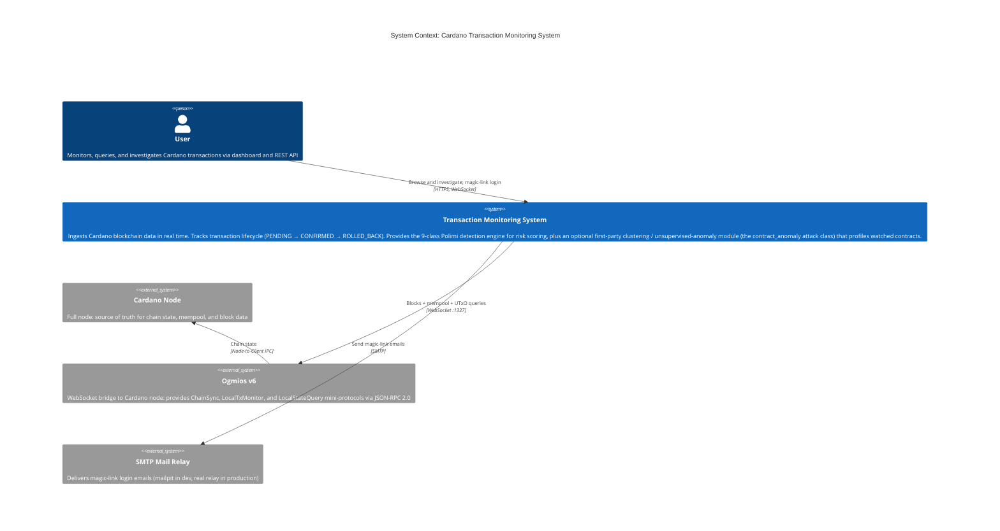
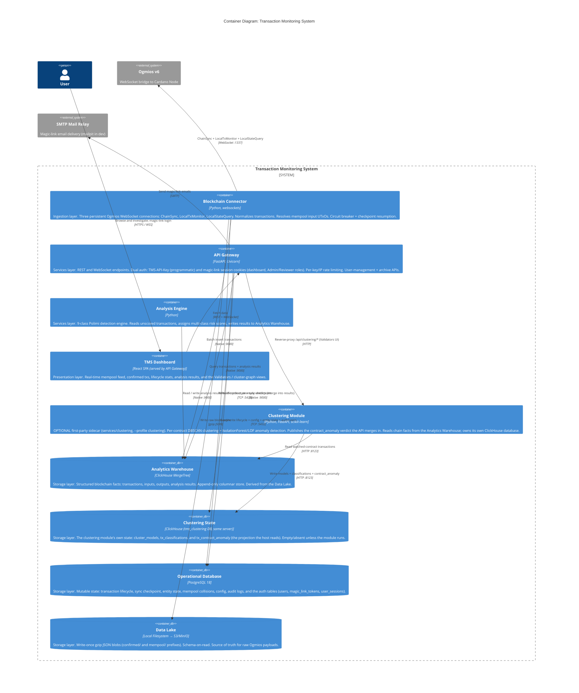
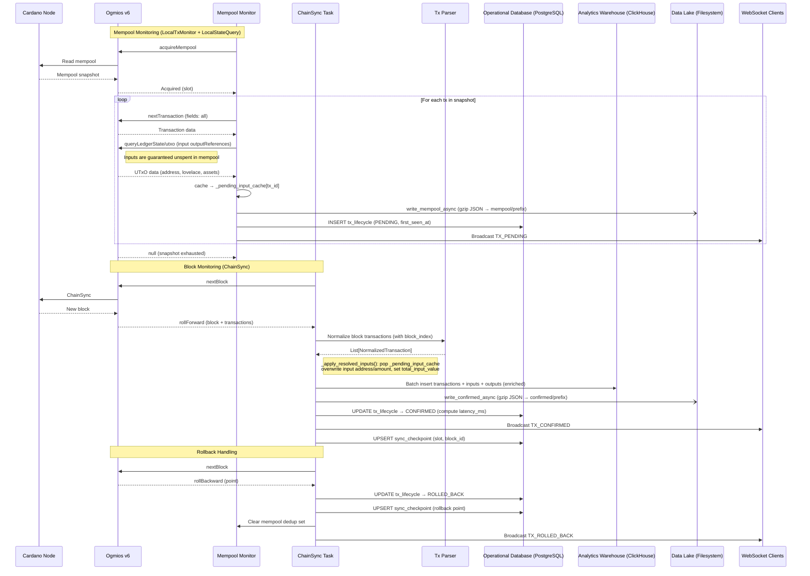
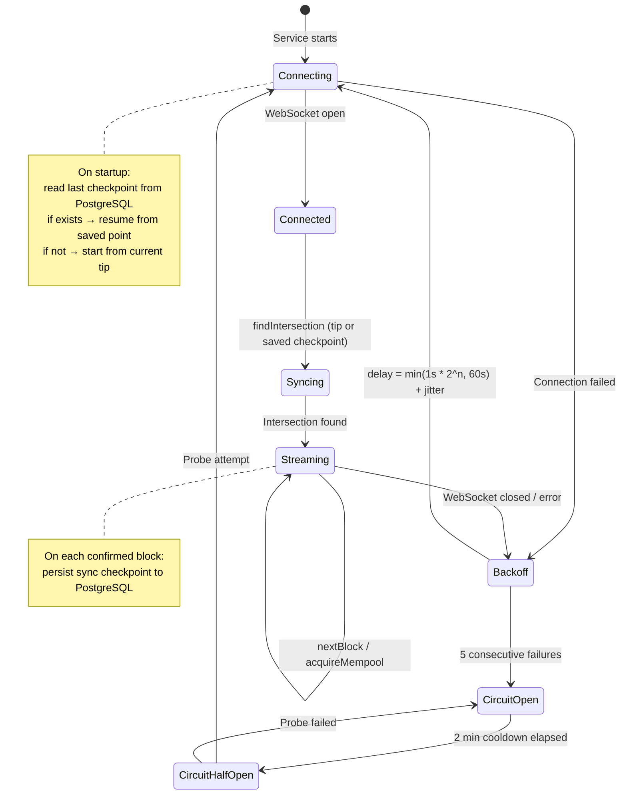
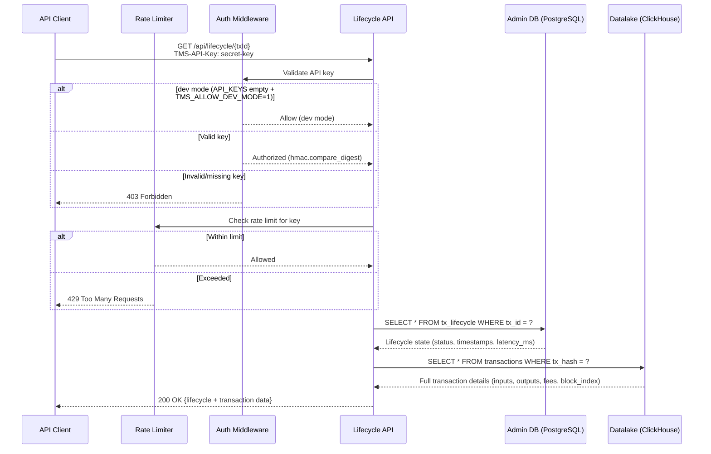
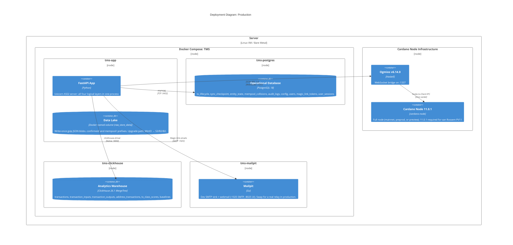

# C4 Architecture: Cardano Transaction Monitoring System

## Level 1: System Context

Who uses the system and what external systems does it interact with.

## Level 2: Container Diagram

The four layers from the spec mapped to running containers.
Event Stream is optional for Preprod; the Blockchain Connector writes directly to storage.

## Level 3: Component Diagram (FastAPI Application)

All four logical layers (Blockchain Connector, API Gateway, Analysis Engine, TMS Dashboard)
run as components within a single FastAPI async process (single-process architecture for Preprod).

```mermaid
C4Component
    title Component Diagram: FastAPI Application

    Container_Boundary(api, "FastAPI Application") {

        Component(lifespan, "Lifespan Manager", "Python asynccontextmanager", "Initializes DB connections, starts background tasks, handles graceful shutdown.")

        Component(ogmios_client, "Ogmios Client", "websockets", "Maintains three persistent WebSocket connections to Ogmios: chain (ChainSync), mempool (LocalTxMonitor), query (LocalStateQuery). Circuit breaker + exponential backoff on chain and mempool. UTxO query connection reconnects on error with graceful degradation.")

        Component(chain_sync, "ChainSync Task", "asyncio background task", "Subscribes to new blocks. On rollForward: applies cached UTxO input data (_apply_resolved_inputs), emits TX_CONFIRMED. On rollBackward: emits TX_ROLLED_BACK.")

        Component(mempool_monitor, "Mempool Monitor Task", "asyncio background task", "Polls mempool via LocalTxMonitor. For each new transaction: inserts TX_PENDING, resolves inputs via queryLedgerState/utxo, stores results in _pending_input_cache.")

        Component(parser, "Transaction Parser", "Python module", "Normalizes Ogmios v6 JSON into NormalizedTransaction. Captures block_index for MEV analysis.")

        Component(analysis_engine, "Analysis Engine", "asyncio background task", "Polls Analytics Warehouse for unscored transactions. 9-class Polimi detection engine assigns multi-class risk scores and labels.")

        Component(tx_api, "Transaction API", "FastAPI Router", "GET /api/transactions/, /api/transactions/{hash}, /api/transactions/address/{addr}, /api/transactions/stats/summary")

        Component(lifecycle_api, "Lifecycle API", "FastAPI Router", "GET /api/lifecycle/{txId}, /api/lifecycle?status=, /api/lifecycle/stats/summary")

        Component(analysis_api, "Analysis API", "FastAPI Router", "GET /api/analysis/results, /api/analysis/results/{hash}, /api/analysis/stats")

        Component(entity_api, "Entity API", "FastAPI Router", "GET/PUT /api/entities/{type}/{id}")

        Component(ws_router, "WebSocket Router", "FastAPI WebSocket", "WS /ws: broadcasts real-time lifecycle events to connected clients.")

        Component(ui_router, "UI Router", "FastAPI Router", "GET /: serves the TMS Dashboard (HTML5).")

        Component(auth_api, "Auth API", "FastAPI Router", "POST /api/auth/request-link, GET /api/auth/verify, POST /api/auth/logout, GET /api/auth/me. Magic-link login + session lifecycle.")

        Component(users_api, "Users API", "FastAPI Router", "GET/POST /api/users, DELETE /api/users/{id}, POST /api/users/{id}/resend-invite. Admin-gated user management.")

        Component(archive_api, "Archive API", "FastAPI Router", "GET/POST/DELETE /api/archive/*. False-positive curation and export.")

        Component(auth, "Auth Module", "FastAPI Security (app/auth)", "Two paths: TMS-API-Key header validation (constant-time, api_key.py) and magic-link sessions (tokens.py, sessions.py, email.py). deps.py exposes require_user / require_admin. Open API-key access requires empty API_KEYS + TMS_ALLOW_DEV_MODE=1, else startup aborts.")

        Component(rate_limiter, "Rate Limiter", "Middleware", "Per-key/IP sliding-window rate limiter. Configurable via RATE_LIMIT_REQUESTS / RATE_LIMIT_WINDOW_SECONDS.")

        Component(ch_adapter, "ClickHouse Adapter", "clickhouse-driver", "Analytics Warehouse. Schema management (clickhouse_schema.py), idempotent migrations, batch inserts, score read/write (clickhouse_scores.py), analytical queries.")

        Component(pg_adapter, "PostgreSQL Adapter", "asyncpg", "Operational Database. Connection pool, tx_lifecycle CRUD, sync_checkpoint, entity_state, audit logging, auth schema (users / magic_link_tokens / user_sessions), schema management.")

        Component(raw_store, "Raw Store Adapter", "gzip + ThreadPoolExecutor", "Data Lake. Async atomic writes of gzip JSON blobs to local filesystem (confirmed/ and mempool/ prefixes). Upgrade path: swap for boto3 S3 calls.")

        Component(config, "Config", "Pydantic Settings", "Loads .env, validates settings, provides typed access.")
    }

    System_Ext(ogmios, "Ogmios v6")
    System_Ext(mail, "SMTP Mail Relay")
    ContainerDb(datalake, "Analytics Warehouse (ClickHouse)")
    ContainerDb(admin_db, "Operational Database (PostgreSQL)")
    ContainerDb(rawstore, "Data Lake (Filesystem)")

    Rel(lifespan, ogmios_client, "Initializes")
    Rel(lifespan, chain_sync, "Starts")
    Rel(lifespan, mempool_monitor, "Starts")
    Rel(lifespan, analysis_engine, "Starts")
    Rel(lifespan, ch_adapter, "Initializes")
    Rel(lifespan, pg_adapter, "Initializes")

    Rel(ogmios_client, ogmios, "WebSocket JSON-RPC 2.0")

    Rel(chain_sync, ogmios_client, "findIntersection, nextBlock")
    Rel(chain_sync, parser, "Raw block data")
    Rel(chain_sync, ch_adapter, "Batch insert transactions")
    Rel(chain_sync, pg_adapter, "Upsert tx_lifecycle → CONFIRMED / ROLLED_BACK; save sync checkpoint")
    Rel(chain_sync, raw_store, "Write confirmed blobs async")
    Rel(chain_sync, ws_router, "Broadcast TX_CONFIRMED / TX_ROLLED_BACK")

    Rel(mempool_monitor, ogmios_client, "acquireMempool, nextTransaction, queryLedgerState/utxo")
    Rel(mempool_monitor, pg_adapter, "Insert TX_PENDING")
    Rel(mempool_monitor, raw_store, "Write mempool blobs async")
    Rel(mempool_monitor, ws_router, "Broadcast TX_PENDING")

    Rel(analysis_engine, ch_adapter, "Read unscored txs, write results")

    Rel(tx_api, auth, "Validate API key")
    Rel(tx_api, rate_limiter, "Check rate limit")
    Rel(tx_api, ch_adapter, "Query transactions")

    Rel(lifecycle_api, auth, "Validate API key")
    Rel(lifecycle_api, rate_limiter, "Check rate limit")
    Rel(lifecycle_api, pg_adapter, "Query tx_lifecycle")

    Rel(analysis_api, auth, "Validate API key")
    Rel(analysis_api, rate_limiter, "Check rate limit")
    Rel(analysis_api, ch_adapter, "Query analysis results")

    Rel(entity_api, auth, "Validate API key")
    Rel(entity_api, pg_adapter, "Get/set entity state")

    Rel(archive_api, auth, "require_user session")
    Rel(archive_api, ch_adapter, "Read/write archive state")

    Rel(auth_api, auth, "Mint/verify magic-link, issue session")
    Rel(auth_api, pg_adapter, "Read/write users + magic_link_tokens + user_sessions")
    Rel(auth_api, mail, "Send magic-link email", "SMTP")

    Rel(users_api, auth, "require_admin session")
    Rel(users_api, pg_adapter, "CRUD users")
    Rel(users_api, mail, "Send invite magic-link", "SMTP")

    Rel(ch_adapter, datalake, "Native protocol :9000")
    Rel(pg_adapter, admin_db, "asyncpg :5432")
    Rel(raw_store, rawstore, "atomic gzip write / os.replace()")
```

## Level 4: Key Data Flows

### Flow 1: Transaction Lifecycle (Ogmios → Storage Layers)

### Flow 2: Reconnection & Circuit Breaker

### Flow 3: API Request (Authenticated Query)

## Deployment View

Ogmios runs alongside the Cardano node, outside the TMS Docker Compose network.
The TMS connects to it via `OGMIOS_WS_URL` (default: `ws://localhost:1337`).

