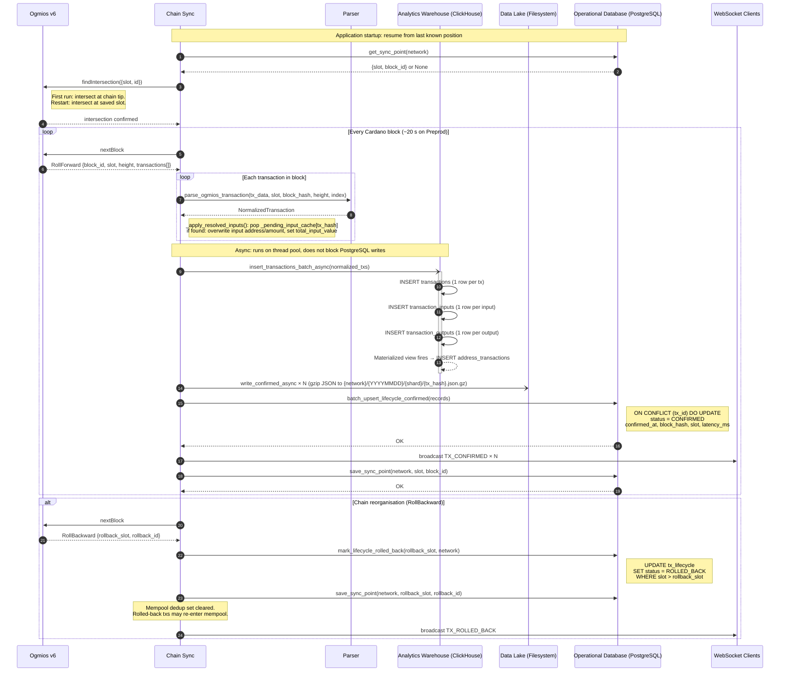
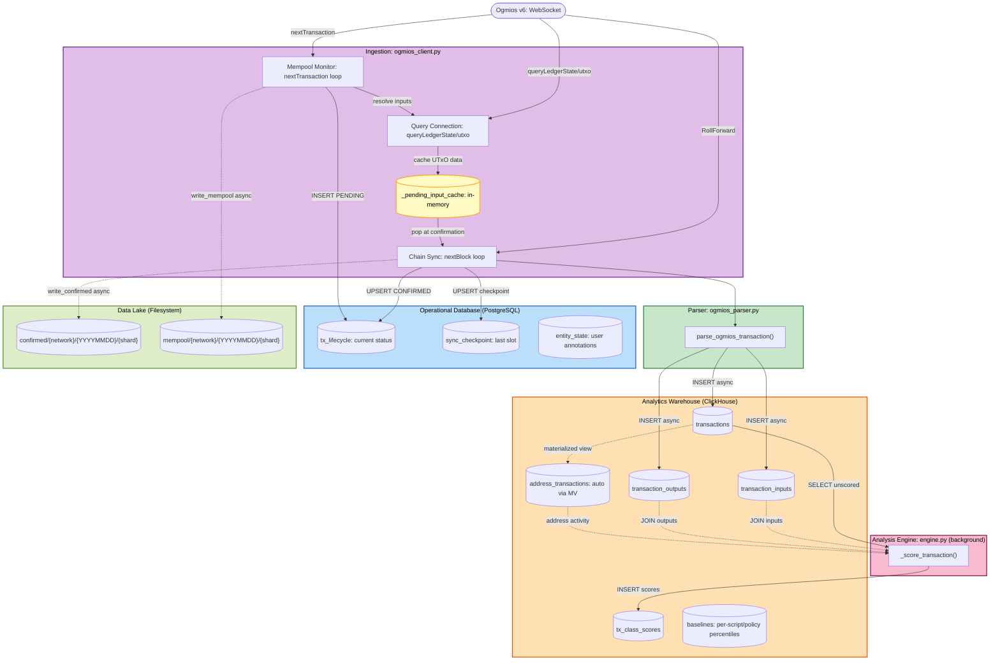
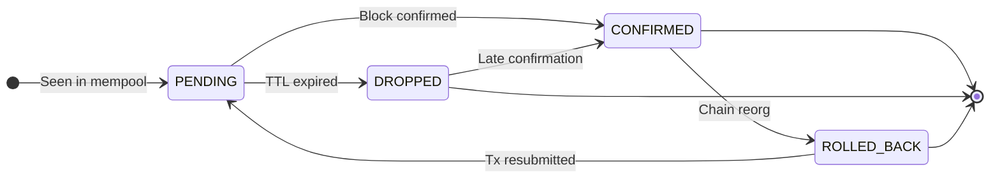

# Data Flow: Cardano Transaction Monitoring System

Three diagrams covering the system's runtime behaviour:

1. [Chain Sync: block ingestion end-to-end](#1-chain-sync-path)
2. [Storage Map: what lands where and why](#2-storage-map)
3. [Transaction Lifecycle: state transitions](#3-transaction-lifecycle-states)

## 1. Chain Sync Path

How a Cardano block travels from the node to every storage layer and connected client.

Three persistent WebSocket connections to Ogmios run independently at all times: chain sync (`nextBlock` loop), mempool (`nextTransaction` loop), and a query connection (`queryLedgerState/utxo`).
This diagram covers the **chain sync** connection.
The mempool connection writes to `tx_lifecycle` (PENDING), the raw store (`mempool/` prefix), and resolves input UTxOs via the query connection, storing results in `_pending_input_cache` for use at confirmation time. Those paths are not shown in the sequence below; see the Storage Map in section 2.

**Key design points:**

- ClickHouse and raw store writes are shown as `-)` (async arrows) because they run on thread pools; the event loop stays responsive and PostgreSQL writes from the mempool monitor can proceed concurrently. However, the chain sync coroutine itself **awaits** both before saving the checkpoint.
- The sync checkpoint is saved **last**, after all storage writes and the WebSocket broadcast. If the process crashes before the checkpoint save, the block is reprocessed on restart. ClickHouse `MergeTree` deduplication and raw store write-once logic (atomic temp-file + rename) handle the duplicate insert gracefully.
- The raw store uses an atomic write pattern (`gzip → .tmp`, then `os.replace()`). A crash mid-write leaves only the `.tmp` file; the final path does not exist, so the write is retried on replay.
- The materialized view `address_transactions_mv` fires automatically on every `INSERT INTO transactions`; no application code required.
- **UTxO input resolution**: when a PENDING tx is observed by the mempool monitor, its inputs are guaranteed unspent (the node validates this before admitting the tx). The system immediately calls `queryLedgerState/utxo` on a third WebSocket connection and caches address + lovelace data per input. When ChainSync confirms the block (~20 s later), those inputs are already spent and no longer queryable; the cached data is applied instead, populating `total_input_value` and input addresses in ClickHouse. For txs confirmed without prior mempool observation, `total_input_value` remains `NULL`.

## 2. Storage Map

What data enters the system, what transforms it, and where it lands.
The vertical axis represents the journey from raw chain event to queryable storage.

**Three storage layers:**

| | Analytics Warehouse (ClickHouse) | Operational Database (PostgreSQL) | Data Lake (Filesystem) |
|---|---|---|---|
| **Role** | Structured facts (derived, queryable) | Mutable state (current lifecycle status) | Raw blobs: full Ogmios payloads, source of truth |
| **Mutation** | Append-only; no row-level UPDATE | Row-level UPDATE/DELETE | Write-once files |
| **Consistency** | Eventually consistent (`FINAL` for latest) | Strongly consistent | N/A; keyed by (prefix, network, date, tx_hash) |
| **Query strength** | Scan millions of rows · GROUP BY · aggregations | Single-row lookup by primary key · transactional upsert | Key lookup by (prefix, network, date, tx_hash) |
| **Data growth** | Unbounded time-series | Bounded; one row per tx | Unbounded; one file per tx |
| **Production upgrade** | - | - | MinIO → S3/R2/B2 |

The Data Lake (filesystem) is the **source of truth** for raw payloads; the Analytics Warehouse (ClickHouse) is derived from it and can be reconstructed by replaying raw files. The `tx_lifecycle` table (PostgreSQL) is the bridge for current state: it owns the **authoritative current status** of every transaction (PENDING / CONFIRMED / ROLLED_BACK / DROPPED), while ClickHouse owns the **full historical record** for analytics, and the filesystem holds the **full raw payloads** for replay and debugging.

## 3. Transaction Lifecycle States

How a transaction moves through the system from first observation to final state.

**State definitions:**

| State | Meaning | Where stored |
|---|---|---|
| **PENDING** | Seen in mempool, not yet on-chain | PostgreSQL `tx_lifecycle` + filesystem `mempool/` (best-effort; the monitor may miss a tx if it was not observed before confirmation) |
| **CONFIRMED** | Included in a confirmed block | PostgreSQL `tx_lifecycle` + ClickHouse `transactions` + filesystem `confirmed/` (authoritative) |
| **ROLLED_BACK** | Was confirmed, block later reorganised away | PostgreSQL `tx_lifecycle` only; ClickHouse row and filesystem `confirmed/` file remain |
| **DROPPED** | Was PENDING, TTL expired without confirmation | PostgreSQL `tx_lifecycle` only; filesystem `mempool/` file remains if the tx was observed by the monitor |

**Notable transitions:**

- **PENDING → DROPPED → CONFIRMED**: A transaction can be dropped from monitoring (TTL expired) but still confirm on-chain later. `batch_upsert_lifecycle_confirmed` uses `ON CONFLICT ... DO UPDATE`, so the status is always corrected to CONFIRMED when a block arrives containing the tx.
- **CONFIRMED → ROLLED_BACK → PENDING**: After a chain reorg, the mempool dedup set is cleared. If the user resubmits the rolled-back transaction, it re-enters as PENDING. In Cardano, reorgs are rare and shallow (1–2 blocks).
- **ClickHouse and filesystem are write-once**: A ROLLED_BACK transaction leaves a row in `transactions` and a file in `confirmed/`. The lifecycle API (PostgreSQL) is the source of truth for current status.
